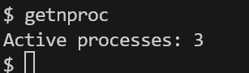

# GetNproc

GetNproc implementation for xv6

---

## 1. `getnproc` — Get number of active processes

### Overview
Returns the number of active processes in the system. The syscall counts processes whose state is not `UNUSED`.

### Syscall number
```c
#define SYS_getnproc 24
```

### Signature
```c
int getnproc(void);
```

### Implementation
The core counting logic is in `kernel/proc.c` (walk the `proc` table, acquire each process lock, count non-`UNUSED` entries):

```c
int
getnproc(void)
{
  struct proc *p;
  int count = 0;

  for(p = proc; p < &proc[NPROC]; p++){
    acquire(&p->lock);
    if(p->state != UNUSED)
      count++;
    release(&p->lock);
  }

  return count;
}
```

The syscall wrapper in `kernel/sysproc.c` simply calls the helper:

```c
uint64
sys_getnproc(void)
{
  return getnproc();
}
```

### Files changed
| File | Change |
|---|---|
| `kernel/syscall.h` | Added `#define SYS_getnproc 24` |
| `kernel/syscall.c` | Added `extern uint64 sys_getnproc(void);` and dispatch table entry |
| `kernel/sysproc.c` | Added `sys_getnproc()` wrapper |
| `kernel/proc.c` | Added `getnproc()` implementation |
| `user/usys.pl` | Added `entry("getnproc")` |
| `user/user.h` | Added `int getnproc(void);` declaration |
| `user/getnproc.c` | Test program |
| `Makefile` | Added `$U/_getnproc` build target entry |

### Test program
```c
#include "kernel/types.h"
#include "user/user.h"

int
main(void)
{
  printf("Active processes: %d\n", getnproc());
  exit(0);
}
```

### Sample output
```
$ getnproc
Active processes: 5
```

### Output explained
The syscall counts all process table slots whose `state` is not `UNUSED`. That includes `RUNNABLE`, `RUNNING`, `SLEEPING`, and `ZOMBIE` states. The returned number reflects how many process slots are currently in use by the kernel.

### Screenshot

