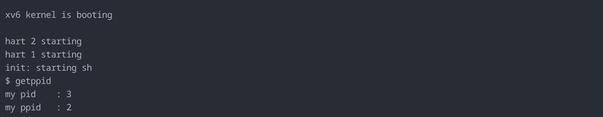

# Custom System Calls

A collection of custom system calls added to xv6-riscv for educational purposes.

---

## 1. `getppid` — Get Parent Process ID

### Overview
Returns the PID of the parent process of the calling process. This is a standard Unix syscall that xv6 does not include by default.

### Syscall number
```c
#define SYS_getppid 22
```

### Signature
```c
int getppid(void);
```

### Implementation
The implementation lives in `kernel/sysproc.c`. It uses `myproc()` to get the current process struct and walks up to its parent:

```c
uint64
sys_getppid(void)
{
  return myproc()->parent->pid;
}
```

### Files changed
| File | Change |
|---|---|
| `kernel/syscall.h` | Added `#define SYS_getppid 22` |
| `kernel/syscall.c` | Added `extern` declaration + dispatch table entry |
| `kernel/sysproc.c` | Implemented `sys_getppid()` |
| `user/usys.pl` | Added `entry("getppid")` |
| `user/user.h` | Added `int getppid(void)` declaration |
| `user/getppid.c` | Test program |
| `Makefile` | 	$U/_getppid
### Test program
```c
#include "kernel/types.h"
#include "user/user.h"

int
main(void)
{
  printf("my pid  : %d\n", getpid());
  printf("my ppid : %d\n", getppid());
  exit(0);
}
```

### Sample output
```
$ getppid
my pid  : 3
my ppid : 2
```

### Output explained
```
PID 1 → init       first process, started by kernel
PID 2 → sh         shell, spawned by init
PID 3 → getppid    your program, spawned by sh
```

When you type `getppid` in the shell, `sh` (PID 2) forks a child and execs your program into it (PID 3). So the parent of your program is always the shell.


### Screenshot
<!-- Add screenshot here -->
